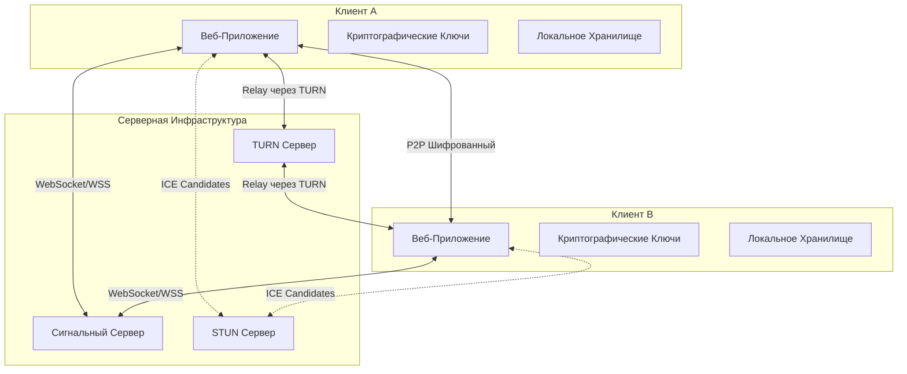

# Документ Проектирования: Защищенный P2P Веб-Мессенджер

## Обзор

Защищенный P2P веб-мессенджер - это веб-приложение, использующее WebRTC для установки прямых peer-to-peer соединений между клиентами. Система состоит из трех основных компонентов:

1. **Веб-клиент** - браузерное приложение на React/TypeScript
2. **Сигнальный сервер** - Node.js сервер для координации WebRTC соединений
3. **TURN/STUN серверы** - для обхода NAT и файрволов

Архитектура обеспечивает end-to-end шифрование всех данных, при этом сигнальный сервер не имеет доступа к содержимому сообщений или ключам шифрования.

## Архитектура

### Общая Архитектура



### Поток Установки Соединения

```mermaid
sequenceDiagram
    participant A as Клиент A
    participant S as Сигнальный Сервер
    participant B as Клиент B
    
    A->>S: Подключение (WebSocket)
    B->>S: Подключение (WebSocket)
    A->>A: Генерация ключевой пары
    B->>B: Генерация ключевой пары
    A->>S: Инициировать звонок к B
    S->>B: Входящий звонок от A
    B->>S: Принять звонок
    A->>S: Offer (SDP)
    S->>B: Offer (SDP)
    B->>S: Answer (SDP)
    S->>A: Answer (SDP)
    A<-->B: Обмен ICE Candidates
    A<-->B: Обмен публичными ключами
    A<-->B: P2P Соединение установлено
    A<-->B: Шифрованный медиа-поток
```

## Компоненты и Интерфейсы

### 1. Веб-Клиент

#### 1.1 Модуль Аутентификации

**Ответственность**: Регистрация, вход и управление сессиями пользователей.

**Интерфейс**:
```typescript
interface AuthService {
  register(username: string, password: string): Promise<User>;
  login(username: string, password: string): Promise<Session>;
  logout(): Promise<void>;
  getCurrentUser(): User | null;
}

interface User {
  id: string;
  username: string;
  publicKey: string;
  createdAt: Date;
}

interface Session {
  userId: string;
  token: string;
  expiresAt: Date;
}
```

**Реализация**:
- Использует bcrypt для хеширования паролей
- Генерирует JWT токены для сессий
- Хранит токены в localStorage
- При регистрации генерирует пару ключей Ed25519 для подписи

#### 1.2 Модуль Криптографии

**Ответственность**: Генерация ключей, шифрование и расшифрование данных.

**Интерфейс**:
```typescript
interface CryptoService {
  generateKeyPair(): Promise<KeyPair>;
  deriveSharedSecret(privateKey: CryptoKey, publicKey: CryptoKey): Promise<CryptoKey>;
  encryptMessage(message: string, sharedSecret: CryptoKey): Promise<EncryptedData>;
  decryptMessage(encrypted: EncryptedData, sharedSecret: CryptoKey): Promise<string>;
  encryptFile(file: Blob, sharedSecret: CryptoKey): Promise<EncryptedData>;
  decryptFile(encrypted: EncryptedData, sharedSecret: CryptoKey): Promise<Blob>;
}

interface KeyPair {
  publicKey: CryptoKey;
  privateKey: CryptoKey;
}

interface EncryptedData {
  ciphertext: ArrayBuffer;
  iv: Uint8Array;
  tag?: Uint8Array;
}
```

**Реализация**:
- Использует Web Crypto API
- Алгоритм обмена ключами: ECDH (Elliptic Curve Diffie-Hellman) с кривой P-256
- Алгоритм шифрования: AES-GCM-256
- Генерирует уникальный IV для каждого сообщения
- Приватные ключи хранятся в IndexedDB с флагом non-extractable

#### 1.3 Модуль Обмена Сообщениями

**Ответственность**: Отправка и получение текстовых сообщений и медиа-файлов.

**Интерфейс**:
```typescript
interface MessagingService {
  sendTextMessage(contactId: string, text: string): Promise<Message>;
  sendMediaFile(contactId: string, file: File): Promise<Message>;
  sendVoiceMessage(contactId: string, audio: Blob): Promise<Message>;
  getMessageHistory(contactId: string, limit: number): Promise<Message[]>;
  markAsRead(messageId: string): Promise<void>;
}

interface Message {
  id: string;
  senderId: string;
  recipientId: string;
  type: 'text' | 'image' | 'video' | 'voice';
  content: string | EncryptedData;
  timestamp: Date;
  delivered: boolean;
  read: boolean;
}
```

**Реализация**:
- Шифрует сообщения перед отправкой через CryptoService
- Хранит историю в IndexedDB
- Использует WebSocket для отправки сообщений через сигнальный сервер
- Поддерживает оффлайн очередь для неотправленных сообщений

#### 1.4 Модуль WebRTC

**Ответственность**: Установка P2P соединений и передача медиа-потоков.

**Интерфейс**:
```typescript
interface WebRTCService {
  initiateCall(contactId: string, type: 'audio' | 'video'): Promise<CallSession>;
  answerCall(callId: string): Promise<CallSession>;
  rejectCall(callId: string): Promise<void>;
  endCall(callId: string): Promise<void>;
  toggleMute(callId: string): void;
  toggleVideo(callId: string): void;
}

interface CallSession {
  id: string;
  contactId: string;
  type: 'audio' | 'video';
  status: 'connecting' | 'connected' | 'ended';
  localStream: MediaStream;
  remoteStream: MediaStream;
  connection: RTCPeerConnection;
  startTime: Date;
}

interface RTCConfiguration {
  iceServers: RTCIceServer[];
  iceTransportPolicy: 'all' | 'relay';
}
```

**Реализация**:
- Использует RTCPeerConnection API
- Конфигурация ICE серверов включает STUN и TURN
- Использует Insertable Streams API для шифрования медиа-фреймов
- Поддерживает адаптивный битрейт через RTCRtpSender.setParameters()
- Кодеки: Opus для аудио, VP8/VP9 для видео

#### 1.5 Модуль Сигнализации

**Ответственность**: Обмен сигнальными сообщениями с сервером.

**Интерфейс**:
```typescript
interface SignalingService {
  connect(): Promise<void>;
  disconnect(): Promise<void>;
  sendOffer(contactId: string, offer: RTCSessionDescriptionInit): Promise<void>;
  sendAnswer(contactId: string, answer: RTCSessionDescriptionInit): Promise<void>;
  sendIceCandidate(contactId: string, candidate: RTCIceCandidate): Promise<void>;
  onIncomingCall(callback: (call: IncomingCall) => void): void;
  onOffer(callback: (offer: SignalMessage) => void): void;
  onAnswer(callback: (answer: SignalMessage) => void): void;
  onIceCandidate(callback: (candidate: RTCIceCandidate) => void): void;
}

interface SignalMessage {
  from: string;
  to: string;
  type: 'offer' | 'answer' | 'ice-candidate' | 'call-request' | 'call-accept' | 'call-reject';
  payload: any;
}

interface IncomingCall {
  callId: string;
  from: string;
  type: 'audio' | 'video';
}
```

**Реализация**:
- Использует WebSocket для двусторонней связи
- Автоматическое переподключение при разрыве соединения
- Heartbeat для поддержания соединения
- Очередь сообщений при временной недоступности

#### 1.6 Модуль Управления Контактами

**Ответственность**: Управление списком контактов и их статусами.

**Интерфейс**:
```typescript
interface ContactService {
  addContact(username: string): Promise<Contact>;
  removeContact(contactId: string): Promise<void>;
  getContacts(): Promise<Contact[]>;
  getContactStatus(contactId: string): Promise<ContactStatus>;
  onStatusChange(callback: (contactId: string, status: ContactStatus) => void): void;
}

interface Contact {
  id: string;
  username: string;
  publicKey: string;
  addedAt: Date;
}

interface ContactStatus {
  online: boolean;
  lastSeen: Date;
}
```

**Реализация**:
- Хранит контакты в IndexedDB
- Получает статусы через WebSocket от сигнального сервера
- Кеширует публичные ключи контактов

### 2. Сигнальный Сервер

#### 2.1 Модуль WebSocket Сервера

**Ответственность**: Управление WebSocket соединениями клиентов.

**Интерфейс**:
```typescript
interface WebSocketServer {
  start(port: number): Promise<void>;
  stop(): Promise<void>;
  onConnection(callback: (client: WebSocketClient) => void): void;
  broadcast(message: any, excludeClient?: string): void;
}

interface WebSocketClient {
  id: string;
  userId: string;
  socket: WebSocket;
  isAlive: boolean;
  send(message: any): void;
  close(): void;
}
```

**Реализация**:
- Использует библиотеку `ws` для Node.js
- Поддерживает WSS (WebSocket Secure) с TLS сертификатами
- Ping/pong для определения живых соединений
- Ограничение скорости для предотвращения спама

#### 2.2 Модуль Маршрутизации Сигналов

**Ответственность**: Маршрутизация сигнальных сообщений между клиентами.

**Интерфейс**:
```typescript
interface SignalRouter {
  routeMessage(from: string, to: string, message: SignalMessage): Promise<void>;
  registerUser(userId: string, clientId: string): void;
  unregisterUser(userId: string): void;
  isUserOnline(userId: string): boolean;
}
```

**Реализация**:
- Хранит маппинг userId -> WebSocket клиент в памяти
- Проверяет существование получателя перед отправкой
- Возвращает ошибку если получатель оффлайн
- Не хранит и не логирует содержимое сообщений

#### 2.3 Модуль Аутентификации

**Ответственность**: Проверка JWT токенов и управление сессиями.

**Интерфейс**:
```typescript
interface AuthMiddleware {
  verifyToken(token: string): Promise<TokenPayload>;
  generateToken(userId: string): Promise<string>;
  revokeToken(token: string): Promise<void>;
}

interface TokenPayload {
  userId: string;
  username: string;
  iat: number;
  exp: number;
}
```

**Реализация**:
- Использует библиотеку `jsonwebtoken`
- Токены действительны 7 дней
- Секретный ключ хранится в переменных окружения
- Проверка токена при каждом WebSocket подключении

#### 2.4 Модуль Управления Пользователями

**Ответственность**: Регистрация, хранение и поиск пользователей.

**Интерфейс**:
```typescript
interface UserManager {
  createUser(username: string, passwordHash: string, publicKey: string): Promise<User>;
  getUserById(userId: string): Promise<User | null>;
  getUserByUsername(username: string): Promise<User | null>;
  updateUserStatus(userId: string, online: boolean): Promise<void>;
}
```

**Реализация**:
- Использует PostgreSQL для хранения пользователей
- Индексы на username для быстрого поиска
- Хранит только публичные ключи пользователей
- Хранит хеши паролей (bcrypt)

### 3. TURN/STUN Серверы

**Конфигурация**:
- Используется coturn как open-source TURN/STUN сервер
- STUN для определения публичного IP адреса
- TURN для ретрансляции трафика когда P2P невозможен
- Аутентификация TURN через временные credentials

## Модели Данных

### База Данных (PostgreSQL)

#### Таблица Users
```sql
CREATE TABLE users (
  id UUID PRIMARY KEY DEFAULT gen_random_uuid(),
  username VARCHAR(50) UNIQUE NOT NULL,
  password_hash VARCHAR(255) NOT NULL,
  public_key TEXT NOT NULL,
  created_at TIMESTAMP DEFAULT CURRENT_TIMESTAMP,
  last_seen TIMESTAMP
);

CREATE INDEX idx_users_username ON users(username);
```

#### Таблица Contacts
```sql
CREATE TABLE contacts (
  id UUID PRIMARY KEY DEFAULT gen_random_uuid(),
  user_id UUID REFERENCES users(id) ON DELETE CASCADE,
  contact_user_id UUID REFERENCES users(id) ON DELETE CASCADE,
  added_at TIMESTAMP DEFAULT CURRENT_TIMESTAMP,
  UNIQUE(user_id, contact_user_id)
);

CREATE INDEX idx_contacts_user_id ON contacts(user_id);
```

### Локальное Хранилище (IndexedDB)

#### Object Store: messages
```typescript
interface StoredMessage {
  id: string;
  contactId: string;
  senderId: string;
  recipientId: string;
  type: 'text' | 'image' | 'video' | 'voice';
  encryptedContent: ArrayBuffer;
  iv: Uint8Array;
  timestamp: number;
  delivered: boolean;
  read: boolean;
}
```

#### Object Store: contacts
```typescript
interface StoredContact {
  id: string;
  username: string;
  publicKey: string;
  sharedSecret?: ArrayBuffer; // Кешированный общий секрет
  addedAt: number;
}
```

#### Object Store: keys
```typescript
interface StoredKeyPair {
  userId: string;
  publicKey: JsonWebKey;
  privateKey: CryptoKey; // non-extractable
  createdAt: number;
}
```

## Свойства Корректности

*Свойство - это характеристика или поведение, которое должно выполняться во всех допустимых выполнениях системы - по сути, формальное утверждение о том, что система должна делать. Свойства служат мостом между человекочитаемыми спецификациями и машинно-проверяемыми гарантиями корректности.*


### Свойство 1: Round-trip шифрования текстовых сообщений

*Для любого* текстового сообщения, шифрование и последующее расшифрование должно вернуть исходное сообщение без изменений.

**Validates: Requirements 2.1, 2.2, 7.2**

### Свойство 2: Round-trip шифрования медиа-файлов

*Для любого* медиа-файла (изображение или видео), шифрование и последующее расшифрование должно вернуть файл с идентичным содержимым.

**Validates: Requirements 3.1, 3.2, 7.3**

### Свойство 3: Round-trip шифрования голосовых сообщений

*Для любого* голосового сообщения, шифрование и последующее расшифрование должно вернуть аудио-файл с идентичным содержимым.

**Validates: Requirements 4.2, 4.3**

### Свойство 4: Создание учетной записи с уникальным идентификатором

*Для любого* уникального идентификатора пользователя и валидного пароля, система должна успешно создать новую учетную запись.

**Validates: Requirements 1.1**

### Свойство 5: Успешная аутентификация с правильными данными

*Для любого* существующего пользователя, предоставление правильного пароля должно привести к успешной аутентификации и созданию сессии.

**Validates: Requirements 1.2**

### Свойство 6: Отклонение неправильного пароля

*Для любого* существующего пользователя, предоставление неправильного пароля должно привести к отклонению попытки входа с сообщением об ошибке.

**Validates: Requirements 1.3**

### Свойство 7: Генерация ключей при аутентификации

*Для любого* успешно аутентифицированного пользователя, система должна сгенерировать пару криптографических ключей (публичный и приватный).

**Validates: Requirements 1.4**

### Свойство 8: Приватные ключи только на клиенте

*Для любого* пользователя, приватные ключи должны храниться только в локальном хранилище клиента и никогда не передаваться на сервер.

**Validates: Requirements 1.5**

### Свойство 9: Немедленное отображение отправленного сообщения

*Для любого* отправленного текстового сообщения, оно должно немедленно появиться в истории чата отправителя.

**Validates: Requirements 2.3**

### Свойство 10: Индикатор доставки сообщения

*Для любого* сообщения, когда оно доставлено получателю, статус сообщения должен измениться на "доставлено".

**Validates: Requirements 2.4**

### Свойство 11: Локальное хранение зашифрованных сообщений

*Для любого* сообщения в локальном хранилище, оно должно быть сохранено в зашифрованном виде.

**Validates: Requirements 2.5**

### Свойство 12: Отображение превью медиа-файлов

*Для любого* отправленного медиа-файла, в истории чата должно отображаться его превью.

**Validates: Requirements 3.3**

### Свойство 13: Поддержка форматов медиа-файлов

*Для любого* файла в поддерживаемых форматах (JPEG, PNG, GIF, MP4, WebM), система должна принять файл, а для файлов в неподдерживаемых форматах - отклонить.

**Validates: Requirements 3.5**

### Свойство 14: Ограничение длительности голосовых сообщений

*Для любого* голосового сообщения, если его длительность превышает 5 минут, система должна отклонить запись.

**Validates: Requirements 4.4**

### Свойство 15: Отображение длительности голосового сообщения

*Для любого* голосового сообщения в истории чата, должна отображаться его длительность.

**Validates: Requirements 4.5**

### Свойство 16: Установка P2P соединения для звонков

*Для любого* инициированного звонка (голосового или видео), система должна установить P2P соединение через сигнальный сервер.

**Validates: Requirements 5.1, 6.1**

### Свойство 17: Шифрование медиа-потоков

*Для любого* активного звонка, все аудио и видео данные должны передаваться через зашифрованный канал.

**Validates: Requirements 5.2, 6.2, 7.4**

### Свойство 18: Закрытие соединения при завершении звонка

*Для любого* завершенного звонка, P2P соединение должно быть закрыто и все медиа-ресурсы освобождены.

**Validates: Requirements 5.4, 6.7**

### Свойство 19: Отображение длительности звонка

*Для любого* активного звонка, система должна отображать текущую длительность звонка.

**Validates: Requirements 5.5**

### Свойство 20: Функция отключения микрофона

*Для любого* активного звонка (голосового или видео), пользователь должен иметь возможность отключить и включить микрофон, при этом аудио-поток должен соответственно останавливаться и возобновляться.

**Validates: Requirements 5.6, 6.6**

### Свойство 21: Отображение видео-потоков

*Для любого* активного видео звонка, система должна отображать как видео собеседника, так и локальное видео.

**Validates: Requirements 6.4**

### Свойство 22: Функция отключения камеры

*Для любого* активного видео звонка, пользователь должен иметь возможность отключить и включить камеру, при этом видео-поток должен соответственно останавливаться и возобновляться.

**Validates: Requirements 6.5**

### Свойство 23: Обмен ключами при установке соединения

*Для любого* нового соединения между пользователями, система должна выполнить обмен ключами с использованием протокола Diffie-Hellman.

**Validates: Requirements 7.1**

### Свойство 24: Сервер не имеет доступа к ключам

*Для любого* взаимодействия с сигнальным сервером, сервер не должен получать доступ к ключам шифрования или расшифрованному контенту.

**Validates: Requirements 7.5**

### Свойство 25: Отображение отпечатка ключа

*Для любого* контакта, пользователь должен иметь возможность просмотреть отпечаток публичного ключа контакта для верификации.

**Validates: Requirements 7.6**

### Свойство 26: Регистрация онлайн статуса

*Для любого* пользователя, подключившегося к системе, сигнальный сервер должен зарегистрировать его как онлайн.

**Validates: Requirements 8.1**

### Свойство 27: Доставка сигнальных сообщений

*Для любого* инициированного звонка, сигнальный сервер должен доставить сигнальные сообщения получателю.

**Validates: Requirements 8.2**

### Свойство 28: Сервер не участвует в передаче данных после установки P2P

*Для любого* установленного P2P соединения, медиа-данные должны передаваться напрямую между клиентами, минуя сигнальный сервер.

**Validates: Requirements 8.3**

### Свойство 29: Поддержка WebRTC сигнализации

*Для любого* WebRTC сигнального сообщения (offer, answer, ICE candidate), сигнальный сервер должен корректно обработать и передать его получателю.

**Validates: Requirements 8.4**

### Свойство 30: Поддержка WebSocket соединений

*Для любого* клиента, сигнальный сервер должен поддерживать WebSocket соединение для обмена сообщениями в реальном времени.

**Validates: Requirements 8.5**

### Свойство 31: Поддержка TURN для обхода блокировок

*Для любого* соединения, система должна поддерживать использование TURN серверов для обхода NAT и файрволов.

**Validates: Requirements 9.1**

### Свойство 32: Fallback на TURN при невозможности P2P

*Для любого* соединения, если прямое P2P соединение невозможно, система должна автоматически использовать TURN сервер для ретрансляции трафика.

**Validates: Requirements 9.2**

### Свойство 33: Поддержка WSS соединений

*Для любого* подключения к сигнальному серверу, должна поддерживаться возможность использования WebSocket Secure (WSS).

**Validates: Requirements 9.3**

### Свойство 34: Настройка пользовательских STUN/TURN серверов

*Для любого* пользователя, система должна позволять настроить и использовать пользовательские STUN/TURN серверы.

**Validates: Requirements 9.4**

### Свойство 35: Отображение списка контактов со статусами

*Для любого* пользователя, веб-клиент должен отображать список его контактов с актуальными индикаторами онлайн статуса.

**Validates: Requirements 10.1**

### Свойство 36: Отображение истории чата с метками времени

*Для любого* чата, веб-клиент должен отображать историю сообщений с временными метками.

**Validates: Requirements 10.2**

### Свойство 37: Уведомления о новых сообщениях

*Для любого* полученного нового сообщения, веб-клиент должен отобразить уведомление пользователю.

**Validates: Requirements 10.3**

### Свойство 38: Адаптивность интерфейса

*Для любого* размера экрана в диапазоне от мобильного до десктопного, веб-клиент должен корректно отображать интерфейс.

**Validates: Requirements 10.5**

### Свойство 39: Добавление контакта

*Для любого* валидного идентификатора пользователя, система должна добавить его в список контактов.

**Validates: Requirements 11.1**

### Свойство 40: Удаление контакта

*Для любого* контакта в списке, система должна удалить его при запросе пользователя.

**Validates: Requirements 11.2**

### Свойство 41: Обновление онлайн статуса контактов

*Для любого* контакта, система должна отображать его актуальный онлайн статус в реальном времени.

**Validates: Requirements 11.3**

### Свойство 42: Локальное хранение контактов

*Для любого* списка контактов, он должен сохраняться в локальном хранилище клиента.

**Validates: Requirements 11.4**

### Свойство 43: Счетчик непрочитанных сообщений

*Для любого* нового сообщения от контакта, счетчик непрочитанных сообщений для этого контакта должен увеличиться.

**Validates: Requirements 11.5**

### Свойство 44: Адаптивный битрейт аудио

*Для любого* активного звонка, система должна автоматически адаптировать битрейт аудио в зависимости от качества соединения.

**Validates: Requirements 12.1**

### Свойство 45: Адаптивный битрейт видео

*Для любого* активного видео звонка, система должна автоматически адаптировать битрейт видео в зависимости от качества соединения.

**Validates: Requirements 12.2**

### Свойство 46: Использование правильных кодеков

*Для любого* звонка, система должна использовать кодек Opus для аудио и VP8 или VP9 для видео.

**Validates: Requirements 12.3**

### Свойство 47: Автоматическое снижение качества видео

*Для любого* активного видео звонка, когда качество соединения ухудшается, система должна автоматически снизить качество видео.

**Validates: Requirements 12.4**

### Свойство 48: Индикатор качества соединения

*Для любого* активного звонка, система должна отображать индикатор текущего качества соединения.

**Validates: Requirements 12.5**

### Свойство 49: Эхоподавление и шумоподавление

*Для любого* аудио-потока, система должна применять эхоподавление и шумоподавление.

**Validates: Requirements 12.6**

## Обработка Ошибок

### Ошибки Аутентификации

- **Неверные учетные данные**: Возврат HTTP 401 с сообщением "Invalid credentials"
- **Пользователь уже существует**: Возврат HTTP 409 с сообщением "Username already exists"
- **Невалидный токен**: Возврат HTTP 401 с сообщением "Invalid or expired token"

### Ошибки Шифрования

- **Ошибка генерации ключей**: Логирование ошибки, уведомление пользователя "Failed to generate encryption keys"
- **Ошибка расшифрования**: Логирование ошибки, отображение сообщения "Unable to decrypt message"
- **Несовпадение ключей**: Уведомление "Encryption key mismatch - please verify contact"

### Ошибки WebRTC

- **Не удалось установить P2P соединение**: Автоматический fallback на TURN сервер
- **Потеря соединения во время звонка**: Попытка переподключения в течение 10 секунд, затем завершение звонка
- **Отказ в доступе к медиа-устройствам**: Уведомление "Camera/microphone access denied"
- **Медиа-устройство не найдено**: Уведомление "No camera/microphone found"

### Ошибки Сигнального Сервера

- **Разрыв WebSocket соединения**: Автоматическое переподключение с экспоненциальной задержкой (1s, 2s, 4s, 8s, max 30s)
- **Получатель оффлайн**: Возврат ошибки "User is offline", сообщение сохраняется локально
- **Таймаут сигнализации**: Отмена звонка после 30 секунд без ответа

### Ошибки Медиа-Файлов

- **Файл слишком большой**: Отклонение загрузки с сообщением "File size exceeds 50MB limit"
- **Неподдерживаемый формат**: Отклонение с сообщением "Unsupported file format"
- **Ошибка чтения файла**: Уведомление "Failed to read file"

### Ошибки Хранилища

- **Квота IndexedDB превышена**: Уведомление "Storage quota exceeded - please clear old messages"
- **Ошибка записи в IndexedDB**: Логирование ошибки, повторная попытка записи
- **Ошибка чтения из IndexedDB**: Логирование ошибки, возврат пустого результата

## Стратегия Тестирования

### Двойной Подход к Тестированию

Система будет тестироваться с использованием двух дополняющих друг друга подходов:

1. **Unit-тесты**: Проверка конкретных примеров, граничных случаев и условий ошибок
2. **Property-based тесты**: Проверка универсальных свойств на множестве сгенерированных входных данных

### Unit-тестирование

**Фокус**:
- Конкретные примеры корректного поведения
- Граничные случаи (пустые строки, максимальные размеры, null значения)
- Условия ошибок и обработка исключений
- Интеграционные точки между компонентами

**Примеры**:
- Тест регистрации с конкретным username и password
- Тест отправки сообщения с пустым текстом (должен быть отклонен)
- Тест загрузки файла размером ровно 50MB (граничный случай)
- Тест входящего звонка когда пользователь оффлайн

**Инструменты**:
- Jest для JavaScript/TypeScript тестов
- React Testing Library для тестирования UI компонентов
- Supertest для тестирования API сигнального сервера

### Property-Based Тестирование

**Фокус**:
- Универсальные свойства, которые должны выполняться для всех входных данных
- Комплексное покрытие входных данных через рандомизацию
- Обнаружение неожиданных граничных случаев

**Конфигурация**:
- Библиотека: fast-check для JavaScript/TypeScript
- Минимум 100 итераций на каждый property-тест
- Каждый тест должен ссылаться на свойство из документа проектирования
- Формат тега: **Feature: secure-p2p-messenger, Property {number}: {property_text}**

**Примеры Property-тестов**:

```typescript
// Feature: secure-p2p-messenger, Property 1: Round-trip шифрования текстовых сообщений
test('any text message encrypted then decrypted returns original', async () => {
  await fc.assert(
    fc.asyncProperty(fc.string(), async (message) => {
      const keyPair = await crypto.generateKeyPair();
      const encrypted = await crypto.encryptMessage(message, keyPair.publicKey);
      const decrypted = await crypto.decryptMessage(encrypted, keyPair.privateKey);
      expect(decrypted).toBe(message);
    }),
    { numRuns: 100 }
  );
});

// Feature: secure-p2p-messenger, Property 4: Создание учетной записи с уникальным идентификатором
test('any unique username and valid password creates account', async () => {
  await fc.assert(
    fc.asyncProperty(
      fc.string({ minLength: 3, maxLength: 50 }),
      fc.string({ minLength: 8 }),
      async (username, password) => {
        const user = await authService.register(username, password);
        expect(user.username).toBe(username);
        expect(user.id).toBeDefined();
      }
    ),
    { numRuns: 100 }
  );
});
```

### Интеграционное Тестирование

**Сценарии**:
- Полный flow регистрации → вход → отправка сообщения
- Установка звонка между двумя клиентами
- Обмен медиа-файлами между пользователями
- Переподключение после разрыва WebSocket соединения

### E2E Тестирование

**Инструменты**: Playwright для автоматизации браузера

**Сценарии**:
- Регистрация нового пользователя через UI
- Голосовой звонок между двумя браузерами
- Видео звонок с отключением камеры/микрофона
- Отправка и получение зашифрованных сообщений

### Тестирование Безопасности

**Проверки**:
- Приватные ключи никогда не покидают клиент
- Сигнальный сервер не имеет доступа к расшифрованным данным
- Все соединения используют TLS/WSS
- Токены имеют ограниченный срок действия
- Защита от CSRF и XSS атак

### Тестирование Производительности

**Метрики**:
- Время установки P2P соединения (цель: < 2 секунды)
- Задержка доставки сообщений (цель: < 500ms)
- Использование памяти при длительном звонке
- Качество видео при различных условиях сети

### Покрытие Кода

**Цели**:
- Минимум 80% покрытие строк кода
- Минимум 70% покрытие ветвлений
- 100% покрытие критических путей (аутентификация, шифрование)
